# Vulnversity
## Learn about active recon, web app attacks and privilege escalation.


# Reconocimiento
---
Nuestro primer paso será escanear usando Nmap. Es una herramienta de código abierto que se utiliza para la exploración de redes. Es genial usarlo para descubrir cosas como puertos abiertos, sistemas operativos, detección de versiones de aplicaciones y servicios y un montón de otras cosas. 

``` sh
-sC : set de scripts por default.
-sV : scripts de detección de versiones.
-p- : escanear todos los puertos de la máquina.
-A : Permite la detección de versiones y sistemas operativos, ejecuta scripts incorporados para una enumeración adicional.
-T4 : Indice de agresividad, es un escaneo agresivo y más rápido.
-Pn : Deshabilite el descubrimiento de host y solo busque puertos abiertos
-oN <nombre de archivo>** : guardar el resultado del escaneo en un archivo de formato 
```

Estos son los resultados del escaneo:
``` sh
nmap -sC -sV -A -T4 -p- -Pn 10.10.189.105 -oA Vulnversity.nmap
``` 

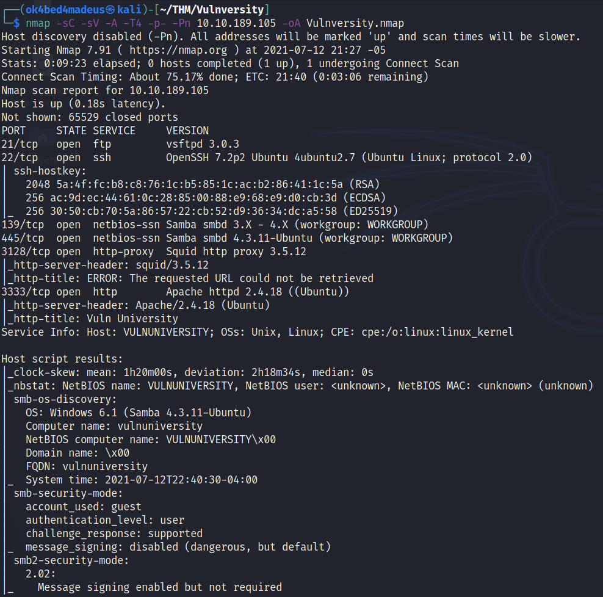

Hay 6 puertos abiertos, Apache está en 3333, así que revisaremos el sitio web.


Aquí está el sitio web. Después de verificar el código fuente, no encontramos nada de interés real, por lo que buscaremos directorios web ocultos.

# Localizar directorios usando GoBuster
---

Con una herramienta de descubrimiento de directorios rápida llamada GoBuster, localizará un directorio que usted o los atacantes normalmente no pueden ver o encontrar porque los directorios están ocultos.

Ahora ejecutemos GoBuster con una lista de palabras 
``` sh
gobuster dir -u http: // <ip>: 3333 -w <ubicación de la lista de palabras>
dir Para especificar un ataque de directorio
-u La URL de destino
-w Ruta a su lista de palabras
```

``` sh
gobuster dir -u http://10.10.189.105:3333 -w /usr/share/wordlists/dirbuster/directory-list-2.3-medium.txt -t 100
``` 

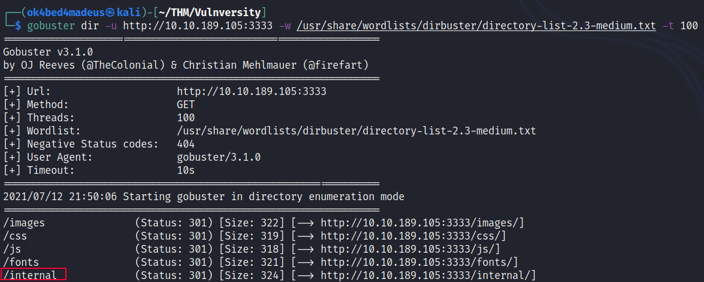

Aqui vemos que en el directorio internal se puede subir archivos

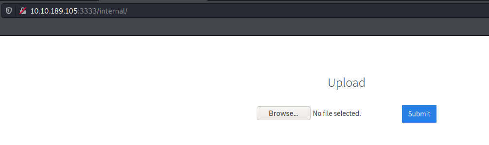

intentamos subiendo un archivo cualquiera y vemos que la extension no soporta pero si permite subir un archivo por lo tanto veremos que extensiones soporta con burpsuite

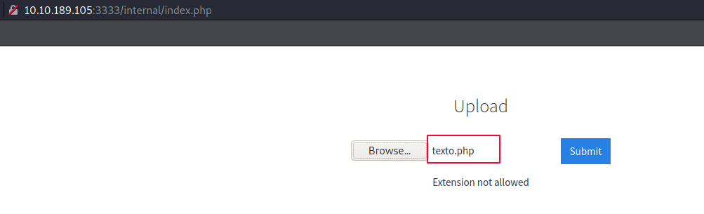

pero antes veremos donde se almacenaran nuestros archivos de carga 
```sh
gobuster dir -u http://10.10.189.105:3333/internal/ -w /usr/share/wordlists/dirbuster/directory-list-2.3-medium.txt -t 100
```
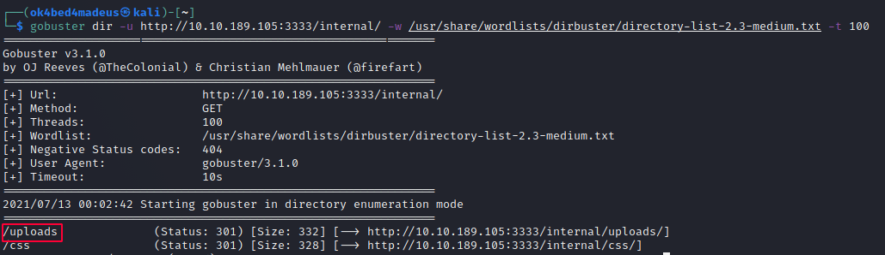

# BurpSuite
---
Conociendo el upload vamos a probar estas extensiones cuales soportan: .php3, .php4, .php5, .phtml ente otras del directorio por defecto de nuestra distribucion 
Ponemos en intruder para hacer una busqueda de la extension

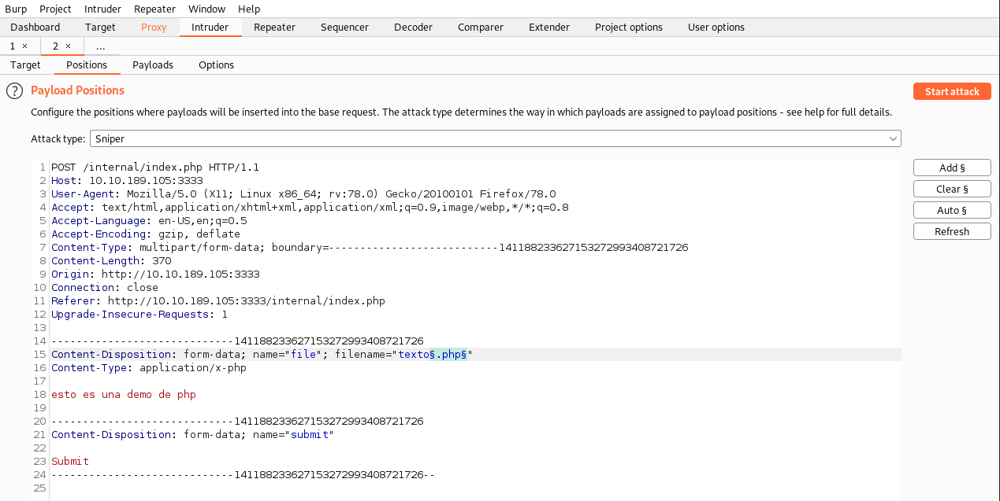

quitamos el check para que no encodee el caracter "." 

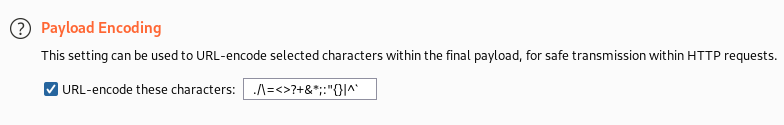

De tal forma que al momendo de hacer la busqueda de extension lo busque con nuestra lista directamente sin encodearse

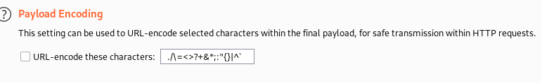

ubicamos nuestra lista  - seclists
locate small-extensions
/usr/share/seclists/Discovery/Web-Content/raft-small-extensions.txt
y lo agregamos al BurpSuite, verificamos la cantidad de lineas que sean igual al archivo txt

vemos lo siguiente que soporta los archivos .phtml

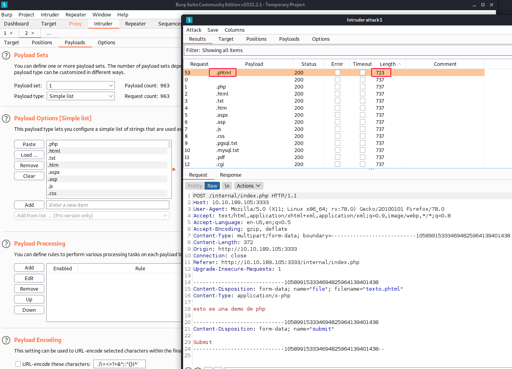

y cuando le damos en renderizar por lo tanto crearemos una reverse shell en php con la extension pthml 

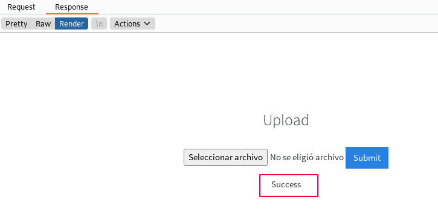

Configuramos nuestra webshell con nuestro IP:PUERTO y ponemos en escucha el netcat

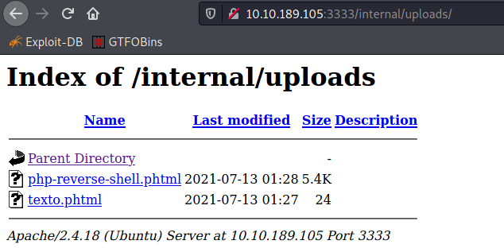

logramos acceder a nuestra shell ahora buscaremos el usuario

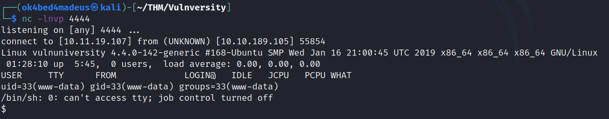

obtenemos nuestra shell interactiva 

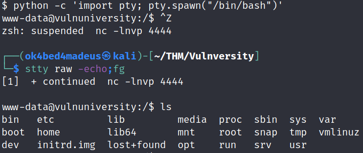

el usuario es: 

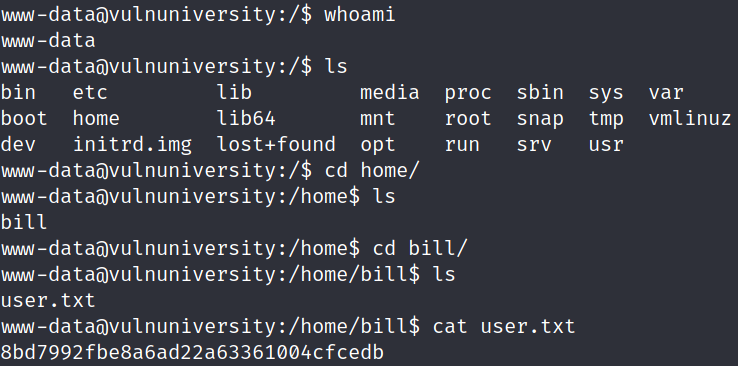

# Escalar Privilegios SUID
---
Probamos
sudo -l y no podemos luego buscamos find / -perm -u=s -type f 2>/dev/null

Observamos que tenemos este SUID systemctl
https://gtfobins.github.io/gtfobins/systemctl/#suid

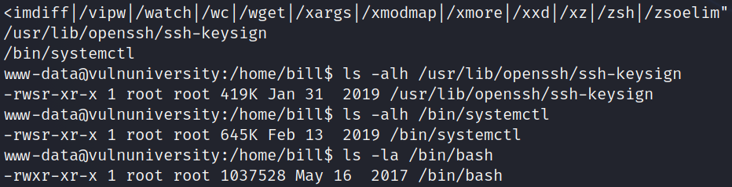

ahora aplicamos lo de GTFOBins

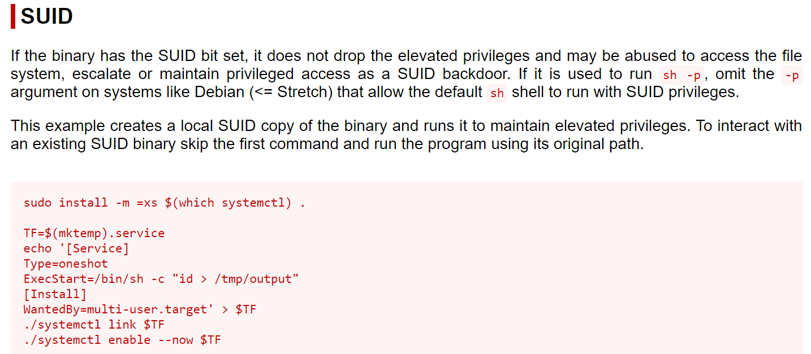

Agregamos el chmod +s para ponerlo como usuario especial el /bin/bash

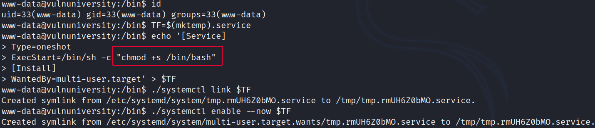

luego verificamos si el /bin/bash cambio de  permiso 

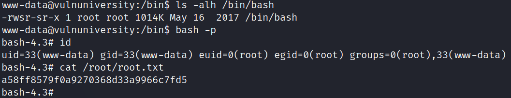

de esta manera se logro acceder a root por medio del cambio de user id de /bin/bash.